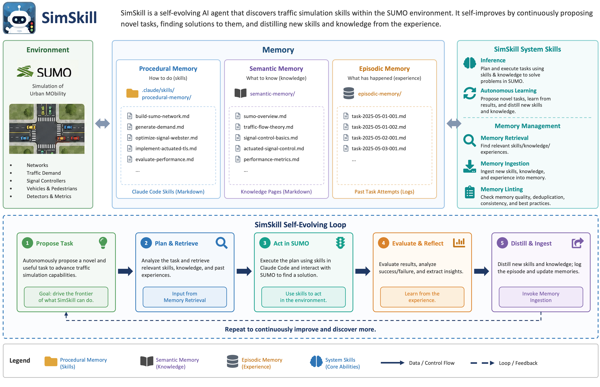
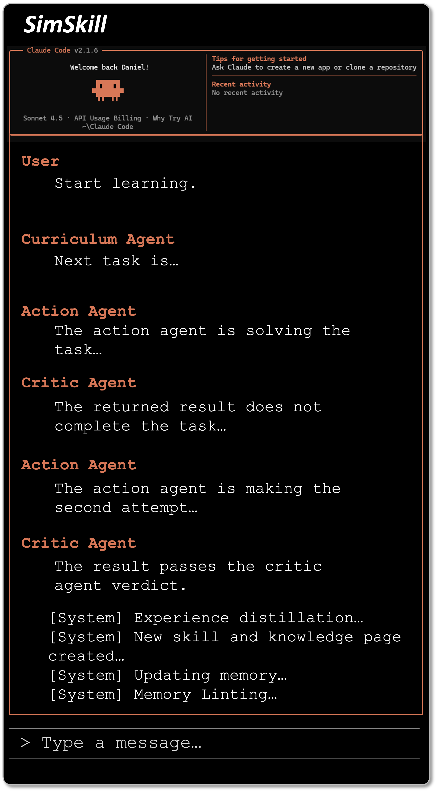
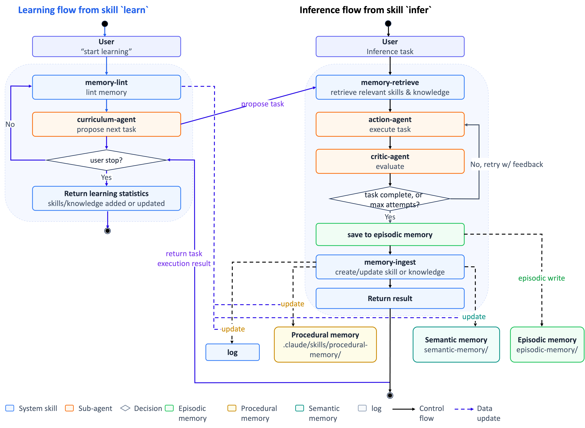
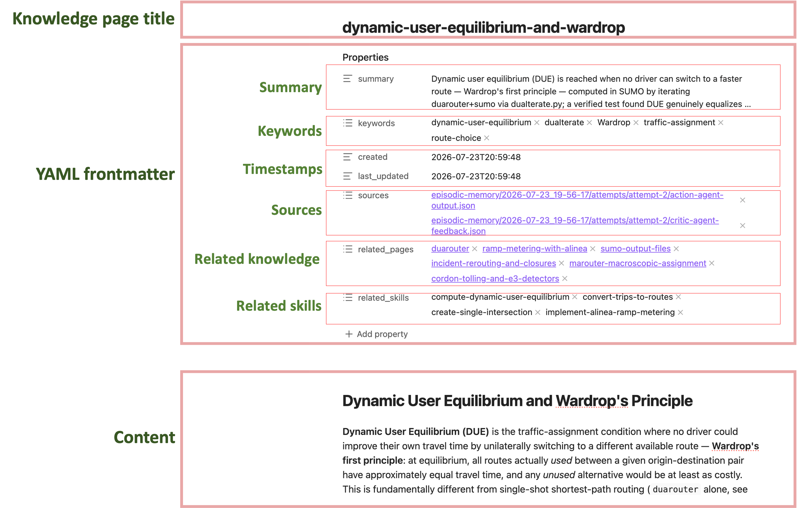
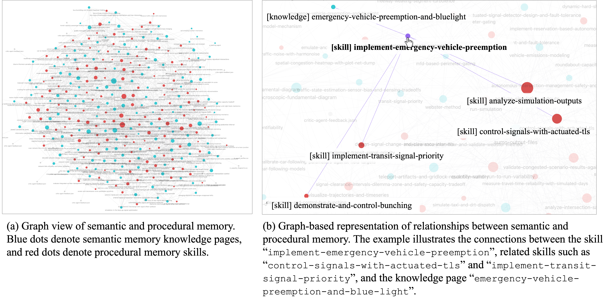
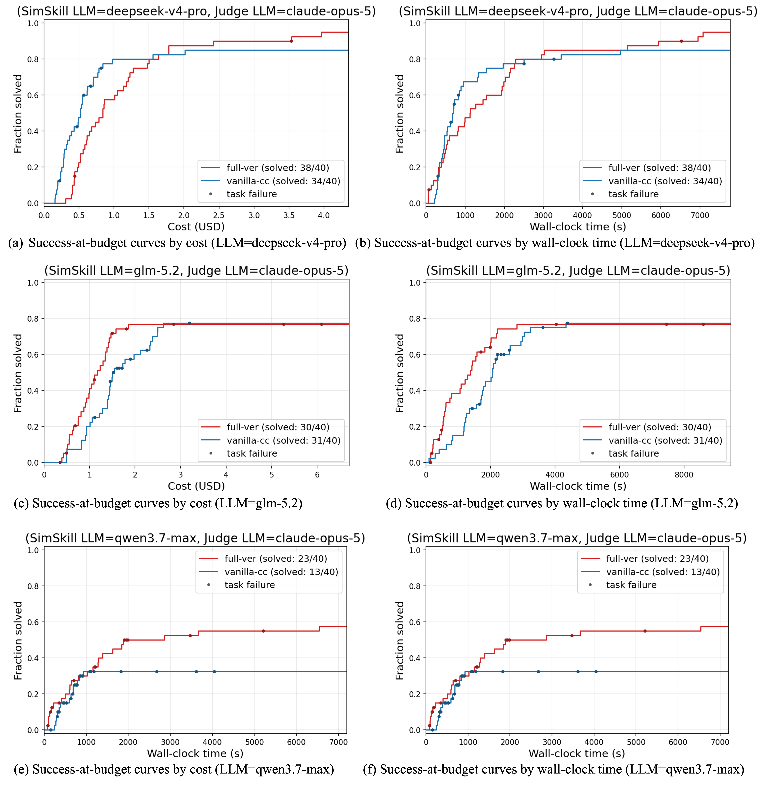
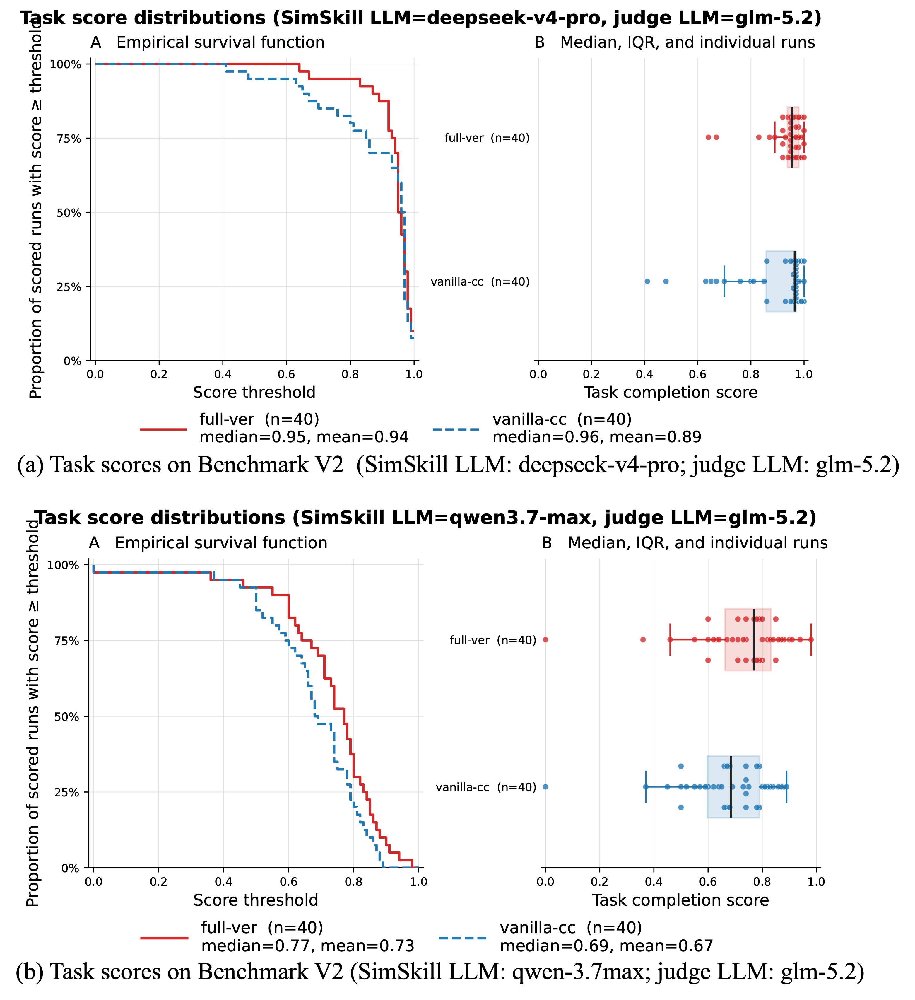
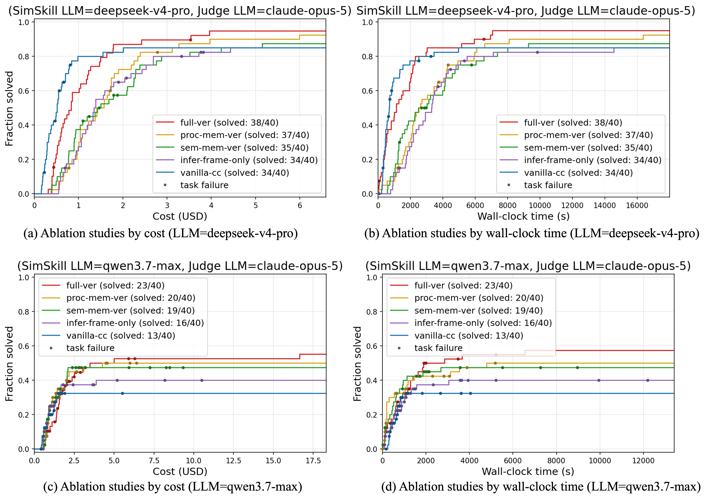

<h1 align="center">SimSkill</h1>

<p align="center">
  <b>A Lifelong Learning AI Agent for Autonomous Mastery of Traffic Simulation</b>
</p>

[](LICENSE)




SimSkill is a self-evolving AI agent that discovers traffic simulation skills within the SUMO (Simulation of Urban MObility) environment. It self-improves by continuously proposing novel tasks, finding solutions to them, and distilling new skills and knowledge from the experience.

SimSkill runs in Claude Code. It has procedural memory (consisting of Claude Code skills), semantic memory (consisting of knowledge pages, markdown files) and episodic memory, which logs the history of past task attempts. SimSkill five core system skills: two for the inference and autonomous learning processes respectively, and three for memory management (retrieval, ingestion, and linting).
Check our arXiv paper [SimSkill: A Self-Evolving LLM Agent for Skill and Knowledge Accumulation in Traffic Simulation](https://arxiv.org/abs/2609.03753) for more details.

This work is inspired by [Voyager](https://voyager.minedojo.org), the lifelong learning agent in Minecraft, and Andrej Karpathy's writing on LLM memory management (["LLM Wiki"](https://gist.github.com/karpathy/442a6bf555914893e9891c11519de94f)).


## Contents
- [Setup](#setup)
- [Quickstart](#quickstart)
- [Architecture](#architecture)
- [Workflow](#workflow)
  - [Inference flow](#inference-flow)
  - [Learning flow](#learning-flow)
- [Project Structure](#project-structure)
- [Memory Representation](#memory-representation)
  - [Procedural Memory Formatting](#procedural-memory-formatting)
  - [Semantic Memory Formatting](#semantic-memory-formatting)
  - [Graph View](#graph-view)
- [Experimentation](#experimentation)
  - [Skills and Knowledge Found](#skills-and-knowledge-found)
  - [Experiment Design](#experiment-design)
  - [Main Results](#main-results)
  - [Ablations](#ablations)
- [Contact](#contact)


## Setup
**Install Claude Code (Required)**
Check out [Claude Code Official Installation Guide](https://code.claude.com/docs/en/quickstart) for installing Claude Code.

**Configure LLMs for Claude Code (Optional)**
You may use custom LLM by configuring `env` in `.claude/settings.json`. An example is given by `.claude/settings.local.json.example`.

**Install Claude Code plugins (Required)**
The following skills are required. You can install them by running the following command in Claude Code:
```
/plugin install skill-creator@claude-plugins-official
```


## Quickstart
**Start open-ended autonomous learning**

Type the following instruction in Claude Code:
```
Start learning
```

Intuitive illustration of the SimSkill learning process:



**Start user-guided autonomous learning (example)**

Type the following instruction in Claude Code:
```
Start learning about urban traffic congestion mitigation. Construct a systematic curriculum covering mitigation strategies, 
congestion visualization and analysis, and methods for evaluating congestion and the effects of interventions.
```

You can resume a learning session by typing the following command in terminal:
```bash
claude --resume <session-id>
```
or you can just create a new Claude Code session to continue learning if there is no need to resume a previous session.

**Run an inference**

To run an inference on your task, you can type the following instruction in Claude Code:
```
(Use /infer) <your task>
```
Run inference in test mode (no changes to memory will be made):
Claude Code:
```
(Use /infer in test mode): <your task>
```

**Manual Memory Lint**

You can manually lint your memory by running the following commands in Claude Code.
For incremental mode memory lint:
```
run a memory lint
```
For a full memory lint:
```
run a full memory lint
```

**Check Memory Status**

To check the status of your memory, you can run the following command in terminal:
```bash
python utils/get_memory_statistics.py
```

Example output (Aug 30, 2026 snapshot):
```
=== Procedural Skills ===
['analyze-intersection-air-quality-hot-spots-from-microsimulation', 'analyze-intersection-safety-with-ssm', 'analyze-simulation-outputs', 'analyze-traffic-noise-with-harmonoise', 'appraise-project-alternatives-with-benefit-cost-analysis', 'assign-traffic-with-marouter', ...]
Count: 150

=== Semantic Memories ===
['abstract-network-generation', 'accessibility-measurement-and-transport-equity', 'activitygen', 'actuated-signal-detector-design-and-fault-tolerance', 'actuated-traffic-signals', 'arterial-signal-progression-resonance-bandwidth-and-delay', 'automated-traffic-signal-performance-measures', ...]
Count: 153
```


## Architecture

SimSkill has the following components:

1. **Memory structure**: SimSkill has three types of memory — episodic, procedural, and semantic — plus a raw-materials store and a shared change log that ties procedural and semantic memory together.
    - **Episodic memory** (`episodic-memory/`): logs the history of user interactions with SimSkill and of self-directed learning attempts.
    - **Procedural memory** (`.claude/skills/procedural-memory/`): stores the skills SimSkill has discovered in the SUMO traffic simulation environment. Each skill describes the process for performing a specific task. Skills are interlinked — a complex skill may depend on simpler ones.
      Examples:
        - `run-simulation`: run a SUMO simulation, via command line or the TraCI API
        - `create-grid-network`: create a grid network in SUMO
        - `generate-random-trips`: generate random trips for a given network in SUMO
        - `optimize-signals-by-tlscycleadaptation`: optimize signal timing in SUMO using the tlsCycleAdaptation algorithm
        - `get-vehicles-state`: read vehicles' state in SUMO
        - `set-vehicle-state`: set a vehicle's state in SUMO
    - **Semantic memory** (`semantic-memory/`): a structured, interlinked knowledge base of facts about the SUMO traffic simulation environment. `semantic-memory/index.md` indexes every page with its summary and keywords, so relevant pages can be found without opening each one individually.
      Examples:
        - `abstract-network-generation`: how to generate an abstract (synthetic) network in SUMO
        - `openstreetmap`: how to import OpenStreetMap data into SUMO
        - `traci`: how to use the TraCI interface in SUMO
        - `od2trips`: how to convert an OD matrix into trips in SUMO
        - `duarouter`: how to use duarouter, which computes vehicle routes and performs traffic assignment in SUMO
    - **Raw materials** (`raw-materials/`): the raw source materials used to generate semantic memory pages — web page clippings, PDF documents, and similar. Knowledge pages cite the specific raw-materials file(s) they were derived from in their `sources` frontmatter.
    - **Change log** (`log.md`): an append-only record, at the project root, of every addition or update to procedural or semantic memory, plus the history of `memory-lint` runs. It's what lets `memory-lint` tell how much new material has accumulated since its last pass, so it isn't tied to either memory type individually.

2. **System skills** (`.claude/skills/system/`): the Claude Code skills that define how SimSkill operates. There are six: `infer`, `learn`, `memory-retrieve`, `memory-ingest`, and `memory-lint`.
    - `infer`: accomplish a given traffic simulation task
    - `learn`: autonomously discover new skills and knowledge in the SUMO environment
    - `memory-retrieve`: retrieve task-relevant skills and knowledge from memory
    - `memory-ingest`: ingest a new traffic simulation experience into memory
    - `memory-lint`: lint procedural and semantic memory
    - `log`: log procedural and semantic memory changes

3. **Sub-agents** (`.claude/agents/`): agents that perform specific steps of the system skills in a separate process with isolated context. SimSkill defines three: `curriculum-agent`, `action-agent`, and `critic-agent`.
    - `curriculum-agent`: proposes the next novel task to explore in the SUMO environment
    - `action-agent`: accomplishes the task proposed by `curriculum-agent`
    - `critic-agent`: evaluates `action-agent`'s performance and provides feedback


## Workflow



### Inference flow

Flow diagram of skill `infer`:
```
User input to start inference
(e.g. "Generate a 3×3 road network. The central east–west and north–south corridors should each consist of six lanes (three lanes per direction),
while all other roads should consist of four lanes (two lanes per direction). At every intersection, provide one additional approach lane on each
incoming leg for channelization. Generate one-hour morning peak traffic demand. Assume that the central business district (CBD) is located to the
northeast of the network. Create two traffic demand scenarios, representing weekday and weekend conditions. Equip all intersections with traffic
signals. Using Webster's method, optimize the signal timing plans for each demand scenario, including phase design and signal timing parameters.")
        ↓
    [S] memory-retrieve:
    retrieve relevant skills
    and knowledge
        ↓
    [A] action-agent: ←───────────┐
    execute task                  │
        ↓                         │ add critic
    [A] critic-agent:             │ feedback to
    evaluate                      │ context
        ↓                         │
    <task complete, or        No  │
     max attempts reached?> ──────┘
        │ Yes
        ↓
    save to episodic memory
        ↓                          
    [S] memory-ingest:             
    create/update skill            
    or knowledge                   
        ↓                          
Return result to main process
```

`[S]` = a skill is used for this step. `[A]` = an agent is invoked for this step.


### Flow diagram of Learning
Flow diagram of skill `learn`:
```
User input to start learning
(e.g. "Start learning")
        ↓
   begin loop iteration ←───────────┐
        ↓                           │       
    [S] memory-lint:                │
    lint memory                     │
        ↓                           │
    [A] curriculum-agent:           │
    propose next task               │
        ↓                           │
    [S] infer:                      │
    generate answer                 │
        ↓             No (default)  │
    <user stops?> ──────────────────┘
        │ Yes
        ↓
Return learning statistics
(e.g. skills/knowledge added or updated)
```

`[S]` = a skill is used for this step. `[A]` = an agent is invoked for this step.


## Project Structure

```
[project_root]/
├── CLAUDE.md                           # SimSkill system description
├── log.md                              # Change log for procedural/semantic memory additions and updates, and memory-lint run history
├── .claude/                            # Claude Code directory
│   ├── agents/                         # SimSkill sub-agents
│   └── skills/                         # Skills library
│       ├── system/                     # SimSkill system skills
│       └── procedural-memory/          # Procedural memory - traffic simulation skills automatically discovered by SimSkill
├── .obsidian/                          # Obsidian settings
├── episodic-memory/                    # Episodic memory - traffic simulation trials
├── raw-materials/                      # Raw materials used to generate semantic memory pages (web clippings, PDFs, etc.)
└── semantic-memory/                    # Semantic memory - a collection of knowledge pages (markdown files)
    └── index.md                        # Index of all knowledge pages (summary + keywords), for retrieval without opening every page
```


## Memory Representation
### Procedural Memory Formatting
File structure for a skill:
```
your-skill-name/
├── SKILL.md # Required - main skill file
├── scripts/ # Optional but recommended - executable code
├── references/ # Optional - documentation
│   ├── api-guide.md # Example
│   └── examples/ # Example
└── assets/ # Optional - templates, etc.
    └── report-template.md # Example
```

A `SKILL.md` file must contain the following:
```
---
name: your-skill-name
description: What it does. Use when user asks to [specific phrases].
---
<skill content>
```

SimSkill use `skill-creator` skill to create a new skill. Other skill-creating skills are also compatible.


### Semantic Memory Formatting

**Knowledge Page Format**



### Graph View
Use Obsidian to open the project root directory.

Run the following command in terminal to copy skills for graph visualization:
```
python utils/copy_skills_for_graph_view.py
```



Note: Obsidian's `graph.json` sets:
```
  "search": "(path:\"semantic-memory\" OR path:\"procedural-memory-for-graph-view\") -file:\"index.md\""
```
PS: Obsidian’s search matches any file whose full path contains the specified string. Therefore, avoid placing folders or files with names such as ``semantic-memory`` or ``procedural-memory-for-graph-view`` anywhere in their path unless you want them to appear in the graph.


## Experimentation

### Skills and Knowledge Found

In approximately 80 hours of autonomous operation over five days, SimSkill accumulated 150 procedural skills and 153 semantic-memory pages spanning the major stages of traffic-simulation practice. The resulting artifacts are inspectable, editable, composable, and transferable across LLM backbones and agent frameworks. 

<b>Scenario construction, execution, and vehicle-state operations</b>

<table>
<thead>
<tr>
<th><sub>Knowledge pages (6)<sub></th>
<th><sub>Procedural skills (6)<sub></th>
</tr>
</thead>
<tbody>
<tr><td><sub><code>change-vehicle-state</code></sub></td><td><sub><code>analyze-simulation-outputs</code></sub></td></tr>
<tr><td><sub><code>mesoscopic-simulation</code></sub></td><td><sub><code>choose-time-discretization-and-integration-method</code></sub></td></tr>
<tr><td><sub><code>sumo-command-line</code></sub></td><td><sub><code>get-vehicles-state</code></sub></td></tr>
<tr><td><sub><code>sumo-output-files</code></sub></td><td><sub><code>run-mesoscopic-simulation</code></sub></td></tr>
<tr><td><sub><code>sumo-time-discretization</code></sub></td><td><sub><code>run-simulation</code></sub></td></tr>
<tr><td><sub><code>traci</code></sub></td><td><sub><code>set-vehicle-state</code></sub></td></tr>
</tbody>
</table>

<b>Network and infrastructure design</b>

<table>
<thead>
<tr>
<th><sub>Knowledge pages (11)<sub></th>
<th><sub>Procedural skills (12)<sub></th>
</tr>
</thead>
<tbody>
<tr><td><sub><code>abstract-network-generation</code></sub></td><td><sub><code>audit-repair-and-persist-imported-network-defects</code></sub></td></tr>
<tr><td><sub><code>cutroutes-and-subnetwork-extraction</code></sub></td><td><sub><code>compare-one-way-vs-two-way-street-grid-conversion</code></sub></td></tr>
<tr><td><sub><code>horizontal-curvature-and-curve-speed-in-sumo</code></sub></td><td><sub><code>create-grid-network</code></sub></td></tr>
<tr><td><sub><code>imported-network-defect-classes-and-traffic-impact</code></sub></td><td><sub><code>create-roundabout-network</code></sub></td></tr>
<tr><td><sub><code>multi-resolution-modeling-buffer-sizing-and-boundary-handoff</code></sub></td><td><sub><code>create-single-intersection</code></sub></td></tr>
<tr><td><sub><code>one-way-vs-two-way-grid-performance-crossover</code></sub></td><td><sub><code>create-spider-network</code></sub></td></tr>
<tr><td><sub><code>opendrive-and-network-format-interoperability</code></sub></td><td><sub><code>extract-subnetwork-scenario-with-boundary-demand</code></sub></td></tr>
<tr><td><sub><code>openstreetmap</code></sub></td><td><sub><code>load-osm-network</code></sub></td></tr>
<tr><td><sub><code>road-gradient-and-energy-consumption</code></sub></td><td><sub><code>model-horizontal-curvature-and-evaluate-design-consistency</code></sub></td></tr>
<tr><td><sub><code>roundabout-modeling-and-comparison</code></sub></td><td><sub><code>model-road-gradient-effects-on-energy</code></sub></td></tr>
<tr><td><sub><code>vehicle-class-lane-permissions</code></sub></td><td><sub><code>model-vclass-lane-permissions</code></sub></td></tr>
<tr><td></td><td><sub><code>quantify-opendrive-roundtrip-fidelity</code></sub></td></tr>
</tbody>
</table>

<b>Demand, routing, and assignment</b>

<table>
<thead>
<tr>
<th><sub>Knowledge pages (17)<sub></th>
<th><sub>Procedural skills (17)<sub></th>
</tr>
</thead>
<tbody>
<tr><td><sub><code>activitygen</code></sub></td><td><sub><code>assign-traffic-with-marouter</code></sub></td></tr>
<tr><td><sub><code>braess-paradox-in-sumo</code></sub></td><td><sub><code>build-four-step-model-with-feedback-loop</code></sub></td></tr>
<tr><td><sub><code>dfrouter-detector-based-demand-reconstruction</code></sub></td><td><sub><code>compute-dynamic-user-equilibrium</code></sub></td></tr>
<tr><td><sub><code>downs-thomson-paradox-and-mode-choice-equilibrium</code></sub></td><td><sub><code>construct-and-verify-braess-paradox</code></sub></td></tr>
<tr><td><sub><code>duarouter</code></sub></td><td><sub><code>convert-od-matrix-to-trips</code></sub></td></tr>
<tr><td><sub><code>dynamic-user-equilibrium-and-wardrop</code></sub></td><td><sub><code>convert-trips-to-routes</code></sub></td></tr>
<tr><td><sub><code>effort-based-routing-and-eco-routing</code></sub></td><td><sub><code>equilibrate-departure-time-choice-in-bottleneck-model</code></sub></td></tr>
<tr><td><sub><code>field-counts-to-simulation-demand-and-the-saturated-count-truncation-trap</code></sub></td><td><sub><code>equilibrate-endogenous-mode-choice-with-transit-supply-feedback</code></sub></td></tr>
<tr><td><sub><code>four-step-model-feedback-loop-convergence</code></sub></td><td><sub><code>generate-activity-based-demand</code></sub></td></tr>
<tr><td><sub><code>gps-map-matching-and-probe-demand-reconstruction</code></sub></td><td><sub><code>generate-demand-with-jtrrouter</code></sub></td></tr>
<tr><td><sub><code>jtrrouter</code></sub></td><td><sub><code>generate-random-trips</code></sub></td></tr>
<tr><td><sub><code>marouter-macroscopic-assignment</code></sub></td><td><sub><code>implement-eco-routing</code></sub></td></tr>
<tr><td><sub><code>od2trips</code></sub></td><td><sub><code>map-match-gps-traces-to-reconstruct-demand</code></sub></td></tr>
<tr><td><sub><code>population-synthesis-and-aggregation-bias</code></sub></td><td><sub><code>reconstruct-demand-with-dfrouter</code></sub></td></tr>
<tr><td><sub><code>random-trips</code></sub></td><td><sub><code>reconstruct-simulation-demand-from-field-turning-movement-counts</code></sub></td></tr>
<tr><td><sub><code>route-choice-model-verification-overlap-and-route-set-effects</code></sub></td><td><sub><code>specify-route-choice-models-and-generate-route-sets</code></sub></td></tr>
<tr><td><sub><code>vickrey-bottleneck-departure-time-equilibrium</code></sub></td><td><sub><code>synthesize-population-and-generate-disaggregate-demand</code></sub></td></tr>
</tbody>
</table>

<b>Signals and intersection control</b>

<table>
<thead>
<tr>
<th><sub>Knowledge pages (31)<sub></th>
<th><sub>Procedural skills (30)<sub></th>
</tr>
</thead>
<tbody>
<tr><td><sub><code>actuated-signal-detector-design-and-fault-tolerance</code></sub></td><td><sub><code>build-atspm-pipeline-and-retime-arterial</code></sub></td></tr>
<tr><td><sub><code>actuated-traffic-signals</code></sub></td><td><sub><code>build-pedestrian-crossings-and-phasing</code></sub></td></tr>
<tr><td><sub><code>arterial-signal-progression-resonance-bandwidth-and-delay</code></sub></td><td><sub><code>compare-left-turn-signal-treatments</code></sub></td></tr>
<tr><td><sub><code>automated-traffic-signal-performance-measures</code></sub></td><td><sub><code>compare-unsignalized-intersection-control-types</code></sub></td></tr>
<tr><td><sub><code>autonomous-intersection-management-safety-and-performance-envelope</code></sub></td><td><sub><code>conduct-driveway-signal-warrant-traffic-impact-analysis</code></sub></td></tr>
<tr><td><sub><code>connected-vehicle-penetration-and-detector-free-signal-control</code></sub></td><td><sub><code>control-signals-with-actuated-tls</code></sub></td></tr>
<tr><td><sub><code>coordinated-adaptive-signal-control-detector-bias-and-transition-cost</code></sub></td><td><sub><code>design-actuated-signal-detector-placement-and-fault-tolerance</code></sub></td></tr>
<tr><td><sub><code>emergency-vehicle-preemption-and-bluelight</code></sub></td><td><sub><code>design-arterial-signal-progression-and-verify-bandwidth</code></sub></td></tr>
<tr><td><sub><code>glosa-eco-driving</code></sub></td><td><sub><code>design-left-turn-storage-bay-length</code></sub></td></tr>
<tr><td><sub><code>intersection-sight-distance-and-sumo-visibility-parameter</code></sub></td><td><sub><code>design-multimodal-signal-progression-for-bicycles-and-cars</code></sub></td></tr>
<tr><td><sub><code>left-turn-storage-bay-length-design</code></sub></td><td><sub><code>design-restricted-crossing-uturn-and-michigan-left-intersections</code></sub></td></tr>
<tr><td><sub><code>left-turn-treatment-tradeoffs</code></sub></td><td><sub><code>design-signal-change-and-clearance-intervals</code></sub></td></tr>
<tr><td><sub><code>max-pressure-signal-control</code></sub></td><td><sub><code>evaluate-right-turn-on-red-and-leading-pedestrian-interval</code></sub></td></tr>
<tr><td><sub><code>multimodal-signal-progression-and-the-bicycle-green-wave</code></sub></td><td><sub><code>implement-detector-free-cv-adaptive-signal-control</code></sub></td></tr>
<tr><td><sub><code>mutcd-signal-warrants-and-the-demand-vs-served-volume-trap</code></sub></td><td><sub><code>implement-emergency-vehicle-preemption</code></sub></td></tr>
<tr><td><sub><code>nema-dual-ring-controller</code></sub></td><td><sub><code>implement-glosa-speed-advisory-controller</code></sub></td></tr>
<tr><td><sub><code>pedestrian-crossings-and-signal-phasing</code></sub></td><td><sub><code>implement-maxpressure-traci-controller</code></sub></td></tr>
<tr><td><sub><code>q-learning-agent</code></sub></td><td><sub><code>implement-nema-dual-ring-controller</code></sub></td></tr>
<tr><td><sub><code>railroad-preemption-of-nearby-signalized-intersections</code></sub></td><td><sub><code>implement-predictive-rolling-horizon-signal-control</code></sub></td></tr>
<tr><td><sub><code>rcut-and-michigan-left-alternative-intersection-design</code></sub></td><td><sub><code>implement-railroad-preemption-at-a-signalized-intersection</code></sub></td></tr>
<tr><td><sub><code>right-turn-on-red-and-leading-pedestrian-interval</code></sub></td><td><sub><code>implement-reservation-based-autonomous-intersection-management</code></sub></td></tr>
<tr><td><sub><code>roundabout-capacity-law-and-demand-metering</code></sub></td><td><sub><code>implement-scats-style-coordinated-adaptive-signal-control</code></sub></td></tr>
<tr><td><sub><code>signal-clearance-intervals-dilemma-zone-and-safety-capacity-tradeoff</code></sub></td><td><sub><code>implement-transit-signal-priority</code></sub></td></tr>
<tr><td><sub><code>simulation-in-the-loop-ga-signal-optimization</code></sub></td><td><sub><code>measure-roundabout-capacity-and-implement-metering</code></sub></td></tr>
<tr><td><sub><code>sumo-rl-environment</code></sub></td><td><sub><code>model-intersection-sight-distance-restriction-at-a-twsc-junction</code></sub></td></tr>
<tr><td><sub><code>tlscoordinator</code></sub></td><td><sub><code>optimize-signal-plan-with-simulation-in-the-loop-ga</code></sub></td></tr>
<tr><td><sub><code>tlscycleadaptation</code></sub></td><td><sub><code>optimize-signals-by-qlearning</code></sub></td></tr>
<tr><td><sub><code>transit-signal-priority</code></sub></td><td><sub><code>optimize-signals-by-tlscoordinator</code></sub></td></tr>
<tr><td><sub><code>unsignalized-vs-signalized-intersection-control</code></sub></td><td><sub><code>optimize-signals-by-tlscycleadaptation</code></sub></td></tr>
<tr><td><sub><code>value-of-anticipation-in-predictive-signal-control</code></sub></td><td><sub><code>switch-signal-plans-by-time-of-day-with-waut</code></sub></td></tr>
<tr><td><sub><code>waut-time-of-day-signal-plan-switching</code></sub></td><td></td></tr>
</tbody>
</table>

<b>Freeway, corridor, and network operations</b>

<table>
<thead>
<tr>
<th><sub>Knowledge pages (31)<sub></th>
<th><sub>Procedural skills (31)<sub></th>
</tr>
</thead>
<tbody>
<tr><td><sub><code>automatic-incident-detection-algorithms</code></sub></td><td><sub><code>build-and-benchmark-freeway-incident-detection</code></sub></td></tr>
<tr><td><sub><code>coordinated-ramp-metering-delay-transfer-and-ramp-storage</code></sub></td><td><sub><code>build-and-evaluate-system-interchange</code></sub></td></tr>
<tr><td><sub><code>cordon-tolling-and-e3-detectors</code></sub></td><td><sub><code>build-diamond-interchange-with-signal-offset-spillback</code></sub></td></tr>
<tr><td><sub><code>corridor-access-management-twltl-representation-and-density-effects</code></sub></td><td><sub><code>build-diverging-diamond-interchange</code></sub></td></tr>
<tr><td><sub><code>diamond-interchange-signal-offset-and-spillback</code></sub></td><td><sub><code>compare-zipper-vs-default-merge-at-lane-drop</code></sub></td></tr>
<tr><td><sub><code>discrete-network-design-and-project-interaction</code></sub></td><td><sub><code>control-one-lane-two-way-alternating-flow-through-a-work-zone</code></sub></td></tr>
<tr><td><sub><code>diverging-diamond-interchange-unopposed-lefts</code></sub></td><td><sub><code>demonstrate-and-stabilize-phantom-traffic-jams</code></sub></td></tr>
<tr><td><sub><code>dynamic-hard-shoulder-running-with-traci-lane-permissions</code></sub></td><td><sub><code>design-and-control-freeway-work-zone-lane-closures</code></sub></td></tr>
<tr><td><sub><code>evacuation-clearance-time-analysis</code></sub></td><td><sub><code>evaluate-corridor-access-management-and-median-treatments</code></sub></td></tr>
<tr><td><sub><code>freeway-weaving-segment-turbulence</code></sub></td><td><sub><code>evaluate-integrated-corridor-management-with-factorial-interaction-design</code></sub></td></tr>
<tr><td><sub><code>freeway-work-zone-capacity-closure-representation-and-merge-control</code></sub></td><td><sub><code>evaluate-neighborhood-traffic-calming-and-cut-through-displacement</code></sub></td></tr>
<tr><td><sub><code>grade-aware-heavy-vehicle-physics-and-climbing-lane-warrants</code></sub></td><td><sub><code>evaluate-two-lane-highway-with-hcm-and-passing-lanes</code></sub></td></tr>
<tr><td><sub><code>incident-rerouting-and-closures</code></sub></td><td><sub><code>form-platoons-with-simpla</code></sub></td></tr>
<tr><td><sub><code>information-penetration-and-congestible-routing</code></sub></td><td><sub><code>implement-alinea-ramp-metering</code></sub></td></tr>
<tr><td><sub><code>integrated-corridor-management-factorial-interaction-findings</code></sub></td><td><sub><code>implement-coordinated-corridor-ramp-metering</code></sub></td></tr>
<tr><td><sub><code>managed-lanes-empty-lane-paradox-and-person-throughput</code></sub></td><td><sub><code>implement-dynamic-hard-shoulder-running</code></sub></td></tr>
<tr><td><sub><code>mfd-based-perimeter-gating</code></sub></td><td><sub><code>implement-mfd-based-perimeter-gating</code></sub></td></tr>
<tr><td><sub><code>neighborhood-traffic-calming-displacement-and-evaporation</code></sub></td><td><sub><code>implement-variable-speed-limits</code></sub></td></tr>
<tr><td><sub><code>network-link-criticality-and-proxy-validation</code></sub></td><td><sub><code>model-adverse-weather-effects-on-freeway-traffic</code></sub></td></tr>
<tr><td><sub><code>one-lane-two-way-alternating-flow-and-shared-lane-representation</code></sub></td><td><sub><code>model-cordon-tolling-with-generalized-cost-surcharge</code></sub></td></tr>
<tr><td><sub><code>opposite-direction-overtaking-mechanics</code></sub></td><td><sub><code>model-freeway-weaving-segment</code></sub></td></tr>
<tr><td><sub><code>phantom-traffic-jams-and-single-av-stabilization</code></sub></td><td><sub><code>model-grade-aware-heavy-vehicle-performance-and-climbing-lanes</code></sub></td></tr>
<tr><td><sub><code>ramp-metering-with-alinea</code></sub></td><td><sub><code>model-managed-lanes-with-dynamic-tolling-and-self-selection</code></sub></td></tr>
<tr><td><sub><code>reversible-lane-encoding-and-changeover-safety</code></sub></td><td><sub><code>model-opposite-direction-overtaking</code></sub></td></tr>
<tr><td><sub><code>simpla-platooning</code></sub></td><td><sub><code>model-toll-plaza-as-queueing-facility</code></sub></td></tr>
<tr><td><sub><code>system-interchange-weaving-and-design-selection</code></sub></td><td><sub><code>operate-reversible-tidal-flow-lane</code></sub></td></tr>
<tr><td><sub><code>toll-plaza-queueing-and-the-service-headway-floor</code></sub></td><td><sub><code>scan-network-link-criticality-and-vulnerability</code></sub></td></tr>
<tr><td><sub><code>two-lane-highway-follower-density-and-passing-lane-effectiveness</code></sub></td><td><sub><code>simulate-emergency-evacuation</code></sub></td></tr>
<tr><td><sub><code>variable-speed-limits-and-e2-detectors</code></sub></td><td><sub><code>simulate-incident-rerouting</code></sub></td></tr>
<tr><td><sub><code>weather-friction-effects-on-capacity-and-safety</code></sub></td><td><sub><code>solve-budget-constrained-network-design-problem</code></sub></td></tr>
<tr><td><sub><code>zipper-merge-lane-drop-discharge</code></sub></td><td><sub><code>sweep-rerouting-device-market-penetration</code></sub></td></tr>
</tbody>
</table>

<b>Transit, multimodal, fleet, and parking systems</b>

<table>
<thead>
<tr>
<th><sub>Knowledge pages (22)<sub></th>
<th><sub>Procedural skills (20)<sub></th>
</tr>
</thead>
<tbody>
<tr><td><sub><code>battery-electric-bus-energy-and-charger-sizing</code></sub></td><td><sub><code>build-and-evaluate-park-and-ride-corridor</code></sub></td></tr>
<tr><td><sub><code>bus-bunching-and-forward-headway-holding</code></sub></td><td><sub><code>build-gtfs-transit-scenario</code></sub></td></tr>
<tr><td><sub><code>bus-stop-infrastructure-design-parking-mechanism-and-tsp-interaction</code></sub></td><td><sub><code>build-rail-corridor-with-railsignal</code></sub></td></tr>
<tr><td><sub><code>car-to-transit-intermodal-transfer-and-park-and-ride</code></sub></td><td><sub><code>build-rail-road-grade-crossing</code></sub></td></tr>
<tr><td><sub><code>cruising-for-parking-search-externality-and-remedies</code></sub></td><td><sub><code>demonstrate-and-control-bus-bunching</code></sub></td></tr>
<tr><td><sub><code>curbside-delivery-blocking-externality</code></sub></td><td><sub><code>design-bus-stop-placement-type-and-spacing</code></sub></td></tr>
<tr><td><sub><code>dedicated-bicycle-lanes-and-mode-share</code></sub></td><td><sub><code>design-transit-service-plan-under-a-bus-hour-budget</code></sub></td></tr>
<tr><td><sub><code>electric-vehicle-battery-and-charging</code></sub></td><td><sub><code>evaluate-protected-bicycle-intersection-design</code></sub></td></tr>
<tr><td><sub><code>gtfs-import-and-pt-representation-semantics</code></sub></td><td><sub><code>model-capacity-constrained-transit-passenger-loading</code></sub></td></tr>
<tr><td><sub><code>intermodal-transfer-and-person-stage-semantics-in-sumo</code></sub></td><td><sub><code>model-cruising-for-parking-search-externality</code></sub></td></tr>
<tr><td><sub><code>parking-areas-and-rerouters</code></sub></td><td><sub><code>model-curbside-delivery-and-lane-blocking-externality</code></sub></td></tr>
<tr><td><sub><code>protected-bicycle-intersection-design-and-right-hook-mechanics</code></sub></td><td><sub><code>model-dedicated-bicycle-lane-infrastructure</code></sub></td></tr>
<tr><td><sub><code>public-transport-and-intermodal-routing</code></sub></td><td><sub><code>model-parking-with-rerouting</code></sub></td></tr>
<tr><td><sub><code>rail-crossing-junction-mechanics</code></sub></td><td><sub><code>model-urban-freight-delivery-tours</code></sub></td></tr>
<tr><td><sub><code>rail-simulation-and-railsignal</code></sub></td><td><sub><code>simulate-ev-charging</code></sub></td></tr>
<tr><td><sub><code>station-based-shared-micromobility-in-sumo</code></sub></td><td><sub><code>simulate-motorcycle-lane-filtering-with-sublane-model</code></sub></td></tr>
<tr><td><sub><code>street-running-tram-reservation-and-right-of-way-tradeoffs</code></sub></td><td><sub><code>simulate-multimodal-transit</code></sub></td></tr>
<tr><td><sub><code>sublane-model-and-lane-filtering</code></sub></td><td><sub><code>simulate-street-running-tram-corridor</code></sub></td></tr>
<tr><td><sub><code>taxi-and-drt-dispatch</code></sub></td><td><sub><code>simulate-taxi-and-drt-dispatch</code></sub></td></tr>
<tr><td><sub><code>transit-capacity-passenger-loading-and-pass-up-dynamics</code></sub></td><td><sub><code>size-battery-electric-bus-fleet-and-chargers</code></sub></td></tr>
<tr><td><sub><code>transit-network-design-and-frequency-setting</code></sub></td><td></td></tr>
<tr><td><sub><code>urban-freight-delivery-tours-container-semantics-and-policy-levers</code></sub></td><td></td></tr>
</tbody>
</table>

<b>Calibration, estimation, and experimental design</b>

<table>
<thead>
<tr>
<th><sub>Knowledge pages (22)<sub></th>
<th><sub>Procedural skills (21)<sub></th>
</tr>
</thead>
<tbody>
<tr><td><sub><code>av-penetration-and-carfollowing-model-mechanism</code></sub></td><td><sub><code>build-macroscopic-fundamental-diagram</code></sub></td></tr>
<tr><td><sub><code>car-following-parameter-calibration-and-identifiability</code></sub></td><td><sub><code>build-rolling-horizon-traffic-forecast-with-state-warm-start</code></sub></td></tr>
<tr><td><sub><code>demand-arrival-process-and-unsignalized-capacity</code></sub></td><td><sub><code>calibrate-car-following-parameters-against-field-targets</code></sub></td></tr>
<tr><td><sub><code>driver-desired-speed-and-speed-enforcement-evaluation</code></sub></td><td><sub><code>calibrate-demand-with-routesampler</code></sub></td></tr>
<tr><td><sub><code>geh-statistic</code></sub></td><td><sub><code>calibrate-desired-speed-and-evaluate-speed-enforcement</code></sub></td></tr>
<tr><td><sub><code>global-sensitivity-analysis-and-parameter-interactions-in-sumo</code></sub></td><td><sub><code>calibrate-flow-with-in-simulation-calibrator</code></sub></td></tr>
<tr><td><sub><code>heavy-vehicle-passenger-car-equivalent-in-sumo</code></sub></td><td><sub><code>calibrate-lane-changing-parameters-at-a-freeway-diverge</code></sub></td></tr>
<tr><td><sub><code>kinematic-wave-theory-validity-across-car-following-models</code></sub></td><td><sub><code>calibrate-motorist-yielding-and-select-midblock-crossing-treatment</code></sub></td></tr>
<tr><td><sub><code>lane-change-model-calibration-and-identifiability-at-a-diverge</code></sub></td><td><sub><code>characterize-pedestrian-flow-and-striping-model-artifacts</code></sub></td></tr>
<tr><td><sub><code>macroscopic-fundamental-diagram</code></sub></td><td><sub><code>design-count-station-locations-for-od-estimation</code></sub></td></tr>
<tr><td><sub><code>motorist-yielding-calibration-and-midblock-crossing-treatment-selection</code></sub></td><td><sub><code>emulate-and-evaluate-partial-sensor-traffic-state-estimation</code></sub></td></tr>
<tr><td><sub><code>od-matrix-estimation-and-underdetermination</code></sub></td><td><sub><code>estimate-od-matrix-with-odme</code></sub></td></tr>
<tr><td><sub><code>pedestrian-flow-theory-and-striping-model-artifacts</code></sub></td><td><sub><code>estimate-stochastic-freeway-capacity-and-breakdown-probability</code></sub></td></tr>
<tr><td><sub><code>routesampler</code></sub></td><td><sub><code>measure-av-penetration-effect-on-bottleneck-capacity</code></sub></td></tr>
<tr><td><sub><code>sensor-location-design-for-od-estimation</code></sub></td><td><sub><code>measure-heavy-vehicle-passenger-car-equivalent</code></sub></td></tr>
<tr><td><sub><code>simulation-based-optimization-under-noise-and-seed-overfitting</code></sub></td><td><sub><code>measure-saturation-flow-and-validate-webster-method</code></sub></td></tr>
<tr><td><sub><code>state-serialization-and-rolling-horizon-traffic-forecasting</code></sub></td><td><sub><code>model-demand-arrival-process-and-its-effect-on-capacity-and-delay</code></sub></td></tr>
<tr><td><sub><code>stochastic-freeway-capacity-and-breakdown-probability</code></sub></td><td><sub><code>optimize-under-simulation-noise-with-a-fixed-budget</code></sub></td></tr>
<tr><td><sub><code>sumo-calibrator</code></sub></td><td><sub><code>quantify-sumo-run-to-run-variability</code></sub></td></tr>
<tr><td><sub><code>sumo-stochastic-variability-and-replication-design</code></sub></td><td><sub><code>screen-and-decompose-sumo-parameter-sensitivity</code></sub></td></tr>
<tr><td><sub><code>traffic-state-estimation-sensor-bias-and-sensing-tradeoffs</code></sub></td><td><sub><code>validate-kinematic-wave-theory-across-car-following-models</code></sub></td></tr>
<tr><td><sub><code>webster-method</code></sub></td><td></td></tr>
</tbody>
</table>

<b>Impact analysis, validation, and visualization</b>

<table>
<thead>
<tr>
<th><sub>Knowledge pages (13)<sub></th>
<th><sub>Procedural skills (13)<sub></th>
</tr>
</thead>
<tbody>
<tr><td><sub><code>accessibility-measurement-and-transport-equity</code></sub></td><td><sub><code>analyze-intersection-air-quality-hot-spots-from-microsimulation</code></sub></td></tr>
<tr><td><sub><code>georeferencing-sumo-output-and-cartographic-fidelity</code></sub></td><td><sub><code>analyze-intersection-safety-with-ssm</code></sub></td></tr>
<tr><td><sub><code>harmonoise-traffic-noise-modeling</code></sub></td><td><sub><code>analyze-traffic-noise-with-harmonoise</code></sub></td></tr>
<tr><td><sub><code>hcm-control-delay-vs-sumo-delay-metrics</code></sub></td><td><sub><code>appraise-project-alternatives-with-benefit-cost-analysis</code></sub></td></tr>
<tr><td><sub><code>intersection-air-quality-hot-spot-analysis</code></sub></td><td><sub><code>evaluate-multimodal-accessibility-and-equity</code></sub></td></tr>
<tr><td><sub><code>network-safety-screening-and-crash-prediction</code></sub></td><td><sub><code>generate-hcm-los-report-and-validate-against-microsimulation</code></sub></td></tr>
<tr><td><sub><code>spatial-congestion-heatmap-with-plot-net-dump</code></sub></td><td><sub><code>measure-travel-time-reliability-with-simulated-days</code></sub></td></tr>
<tr><td><sub><code>sumo-plotting-tools</code></sub></td><td><sub><code>publish-georeferenced-and-animated-results</code></sub></td></tr>
<tr><td><sub><code>surrogate-safety-measures</code></sub></td><td><sub><code>screen-network-safety-with-spf-and-empirical-bayes</code></sub></td></tr>
<tr><td><sub><code>teleport-artifacts-and-gridlock-resolution-validity</code></sub></td><td><sub><code>simulate-fleet-emissions</code></sub></td></tr>
<tr><td><sub><code>transport-economic-appraisal-from-microsimulation</code></sub></td><td><sub><code>validate-congested-scenario-results-against-teleport-artifacts</code></sub></td></tr>
<tr><td><sub><code>travel-time-reliability-metrics-in-sumo</code></sub></td><td><sub><code>visualize-network-congestion-heatmap</code></sub></td></tr>
<tr><td><sub><code>vehicle-emissions-modeling</code></sub></td><td><sub><code>visualize-trajectories-and-timeseries</code></sub></td></tr>
</tbody>
</table>


### Experiment Design
Check out the [test](test/) directory experiment design. [Experiments](test/experiments.md) introduces the experiment design and how to run them.
Experiment results of the paper are stored in [save](test/save/).


### Main Results

Verified completion on Benchmark V1 as a function of observed monetary or wall-clock
budget. Each panel uses the budget shown on its horizontal axis. Red curves show complete SimSkill
and blue curves show vanilla Claude Code; endpoint labels give verified completions out of all 40 tasks,
and markers locate verified failures at their consumed resource levels.


Verified completion on the hard Benchmark V2 as a function of observed monetary or wall-
clock budget.


Complete SimSkill versus vanilla Claude Code. Completion is reported as verified tasks out of 40, with percentages in parentheses. Cost and time entries are per-run medians in the form full/vanilla.
```
  --------------------------------------------------------------------------------------
  Benchmark   Backbone                Full    Vanilla     Δ (pp)    Cost F/V    Time F/V
                                                                       (USD)         (s)
  ----------- ----------------- ---------- ---------- ---------- ----------- -----------
  V1          DeepSeek-V4-Pro   38 (95.0%) 34 (85.0%)      +10.0   0.78/0.49    1056/650

  V1          GLM-5.2           30 (75.0%) 31 (77.5%)       -2.5   1.02/1.47    918/1918

  V1          Qwen3.7-Max       23 (57.5%) 13 (32.5%)      +25.0   1.84/1.03     851/683

  V2          DeepSeek-V4-Pro   27 (67.5%) 19 (47.5%)      +20.0   3.93/2.92   4623/4796

  V2          GLM-5.2           10 (25.0%) 10 (25.0%)        0.0   2.29/2.44   2008/2899

  V2          Qwen3.7-Max         2 (5.0%)   0 (0.0%)       +5.0   2.16/2.35    916/1969
  --------------------------------------------------------------------------------------
```

We also provide a second evaluation of the Benchmark V2 outputs using GLM-5.2 pointwise judge. The continuous judge agrees with the direction of the Claude Opus~5 binary results for the two evaluated backbones while revealing substantial partial completion among most tasks that did not pass the binary threshold.



**Findings**:
- SimSkill performance is significantly better than vanilla Claude Code. SimSkill also enables some long-horizon completion even when the baseline does not.
- The result is not universal across models. GLM-5.2 shows no gain.
- Results provide evidence that the accumulated library can support new compositions and first-principles tasks rather than only near-duplicates of past experience.


### Ablations

Benchmark V1 ablation curves for DeepSeek-V4-Pro (top) and Qwen3.7-Max (bottom),
under the Claude Opus 5 binary judge. The left panels use dollar cost and the right panels use wall-
clock time.



Above figure compare all five conditions on V1. Procedural memory contributes slightly more than semantic memory for both backbones, but neither representation subsumes the other.


## Contact

For any questions, please contact Qi Liu at liuqi_tj[at]hotmail.com.